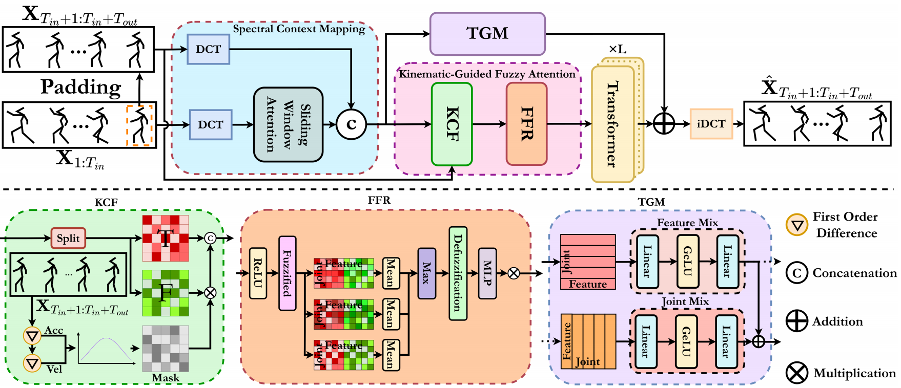

## Fuzzy-Logic Guided Kinematic Prior Model for3D Human Motion Prediction
This is the code for the paper

Botao Zhou， Wenming Cao， Wenbin Zou, Jianqi Zhong
[_Fuzzy-Logic Guided Kinematic Prior Model for3D Human Motion Prediction_]

### Overview


### Dependencies

* cuda 12.1
* Python 3.10
* [Pytorch] 2.1.0

### Get the data

[Human3.6m](http://vision.imar.ro/human3.6m/description.php) in exponential map can be downloaded from [here](http://www.cs.stanford.edu/people/ashesh/h3.6m.zip).

Directory structure: 
```shell script
H3.6m
|-- S1
|-- S5
|-- S6
|-- ...
`-- S11
```
[AMASS](https://amass.is.tue.mpg.de/en) from their official website..

Directory structure:
```shell script
amass
|-- ACCAD
|-- BioMotionLab_NTroje
|-- CMU
|-- ...
`-- Transitions_mocap
```
[3DPW](https://virtualhumans.mpi-inf.mpg.de/3DPW/) from their official website.

Directory structure: 
```shell script
3dpw
|-- imageFiles
|   |-- courtyard_arguing_00
|   |-- courtyard_backpack_00
|   |-- ...
`-- sequenceFiles
    |-- test
    |-- train
    `-- validation
```
Put the all downloaded datasets in ./datasets directory.

### Training
All the running args are defined in [opt.py](utils/opt.py). We use following commands to train on different datasets and representations.
To train,
```bash
python main_h36m_3d.py --kernel_size 10 --dct_n 20 --input_n 50 --output_n 10 --skip_rate 1 --batch_size 128 --test_batch_size 128 --in_features 66 --num_stage 14  
```
```bash
python main_h36m_ang.py --kernel_size 10 --dct_n 20 --input_n 50 --output_n 10 --skip_rate 1 --batch_size 32 --test_batch_size 32 --in_features 48 --num_stage 14
```
```bash
python main_amass_3d.py --kernel_size 10 --dct_n 35 --input_n 50 --output_n 25 --skip_rate 5 --batch_size 128 --test_batch_size 128 --in_features 54 --num_stage 14
```
### Evaluation
To evaluate the pretrained model,
```bash
python main_h36m_3d_eval.py --is_eval --kernel_size 10 --dct_n 20 --input_n 50 --output_n 10 --skip_rate 1 --batch_size 64 --test_batch_size 128 --in_features 66 --num_stage 14 --ckpt checkpoint/main_h36m_3d_in50_out10_ks10_dctn20
python main_h36m_3d_eval.py --is_eval --kernel_size 10 --dct_n 20 --input_n 50 --output_n 25 --skip_rate 1 --batch_size 64 --test_batch_size 128 --in_features 66 --num_stage 14 --ckpt checkpoint/main_h36m_3d_in50_out25_ks10_dctn20
```
```bash
python main_h36m_ang_eval.py --is_eval --kernel_size 10 --dct_n 20 --input_n 50 --output_n 25 --skip_rate 1 --batch_size 32 --test_batch_size 32 --in_features 48 --num_stage 14 --ckpt ./checkpoint/pretrained/h36m_ang_in50_out10_dctn20/
```
```bash
python main_amass_3d_eval.py --is_eval --kernel_size 10 --dct_n 35 --input_n 50 --output_n 25 --skip_rate 5 --batch_size 128 --test_batch_size 128 --in_features 54 --num_stage 14 --ckpt ./checkpoint/pretrained/amass_3d_in50_out25_dctn30/
```

### Citing

If you use our code, please cite our work

```
@inproceedings{tao2025PDANet,
  title={Progressively deeper attention networks for 3D human motion prediction},
  author={Jiangtao Huang, Dong He, Wenming Cao, Jianqi Zhong},
  booktitle={Multimedia System},
  year={2025}
}
```

### Acknowledgments
The overall code framework (dataloading, training, testing etc.) is adapted from [HisRepItself](https://github.com/wei-mao-2019/HisRepItself). 

The predictor model code is adapted from [LTD](https://github.com/wei-mao-2019/LearnTrajDep).

Some of our evaluation code and data process code was adapted/ported from [Residual Sup. RNN](https://github.com/una-dinosauria/human-motion-prediction) by [Julieta](https://github.com/una-dinosauria). 

### Licence
MIT
